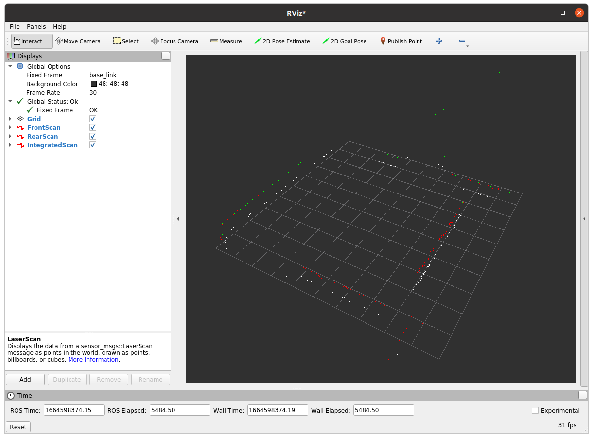

# laser_scan_integrator

A full c++ based ros2 package to merge several laserscan / lidars topics by creating a new virtual laserscan topic. Each source laserscan could be configure via TF to determine the heading of each source laserscan and the relative position of each source laserscan to the virtual laserscan.

This package is created with reference to https://github.com/mich1342/ros2_laser_scan_merger.

The features of this package are below:
- This can merge laserscan to LaserScan topic directly.
- This can recognize relative position of sensor by using TF.
- This can set robot footprint to ignore robot frame.
- This can set offset relative position with parameters.

## Prerequisite
1. ROS2 (Tested on Galactic)
2. Your laserscans driver (Tested using RPLIDAR S1 and RPLIDAR S1)
3. RVIZ2
4. RQT

## How to use 
1. Clone the repo to your ros2 workspace
```bash
git clone https://github.com/hijimasa/laser_scan_integrator.git
```
2. Edit the topic name in the launch file if needed

3. Build and Source
```bash
colcon build && source install/setup.bash
```
4. Launch the package
- To launch without visualizer
```bash
ros2 launch laser_scan_integrator integrate_2_scan.launch.py
```
- To launch with visualizer (RVIZ2)
```bash
ros2 launch laser_scan_integrator visualize_integrated_2_scan.launch.py
```

*Make sure that your laserscans topics already published before launch anything from this package <br />
5. Open RQT to set the parameter
```bash
rqt
```

## TODO
- I would like to calculate the offset of relative position by using scan matching.
